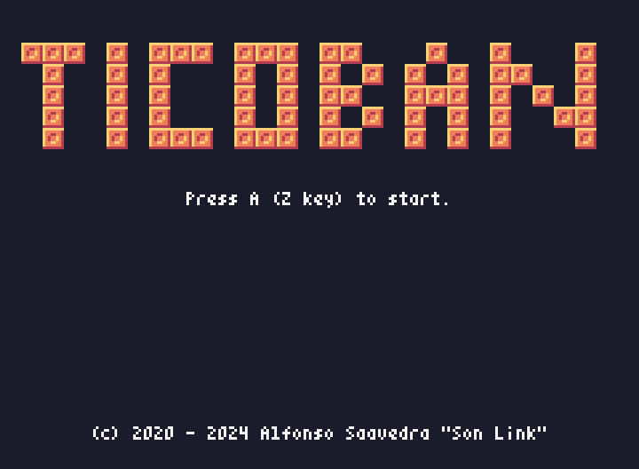

# Ticoban

[Play online version/Juega a la versión en linea](https://son-link.github.io/ticoban-pyxel/)

## English

A Sobokan clone make with [Pyxel](https://github.com/kitao/pyxel). 

In this game you must move the balls to the holes to go to the next level.

### Controls

* A button (Z key): OK
* Pad / keyboard arrows: scroll (left and right in the language selection to select it)

### Special thanks

To the people of the Telegram channel of [Jugando En Linux] (https: //jugandoenlinux.xom), for trying it and supporting me.

Under the GNU/GPL3 or newer license
## Español

Un clone de Sokoban hecho con [Pyxel](https://github.com/kitao/pyxel).

En este juego debes de mover las bolas hasta los agujeros para pasar al siguiente nivel.

### Controles:

* Botón A (tecla Z): Aceptar
* Pad (Flechas teclado): desplazarse (izquierda y derecha en la de selección de idioma para seleccionarlo)

### Agradecimientos

* A la gente del canal de Telegram de [Jugando En Linux](https://jugandoenlinux.xom), por probarlo y soportarme.

Bajo licencia GNU/GPL3 o más reciente

